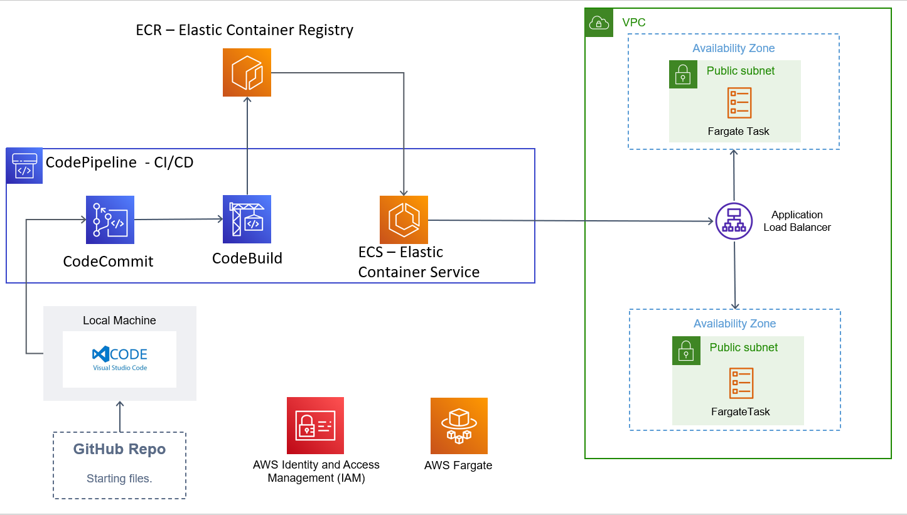
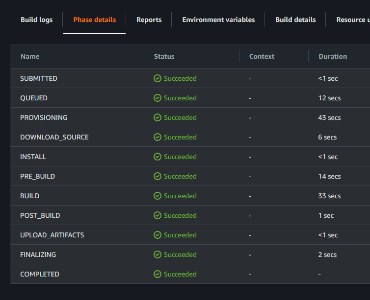

# Skillstorm 
# CodeCommit / CodeBuild / CodePipeline / ECR / ECS with Fargate demo
1 day lecture components and instructions:


-----------------------------------------------------------------------------------------------------------------------------------------
NOTE: I suggest opening a blank text file to copy and paste to, to keep track of all of the names you will be using for the various repositories, images, containers, username, password, etc. You will need to refer to them in later steps.

## Steps:
-----------------------------------------------------------------------------------------------------------------------------------------
1) Download this GitHub repository as a .ZIP file. (click the green button **CODE** and choose **Download Zip**)
2) Unzip files into a folder of your choosing on your local machine.
3) Open the folder in VSCODE.
-----------------------------------------------------------------------------------------------------------------------------------------
4) In the AWS management console, choose **IAM -> Users -> Add Users**. Choose a user name and click **Next**. *example: abc-codecommit-user*
5) Choose **Attach Policies Directly** and search for *AWSCodeCommitPowerUser*.
6) Click the check box next to the AWS managed policy named *AWSCodeCommitPowerUser* and click **Next**. Click **Create User**.
-----------------------------------------------------------------------------------------------------------------------------------------
7) Generate GIT credentials by clicking into the just created User.
8) Under the **Security Credentials** tab, scroll down until you see **HTTPS Git credentials for AWS CodeCommit**.
9) Click the **Generate Credentials** button.
10) **Copy** the username and password for later use. You can also **download** a .csv file with the username and password.
-----------------------------------------------------------------------------------------------------------------------------------------
11) In the AWS management console, choose **CodeCommit -> Repositories -> Create repository** and create a new repository.
12) Give the repository a name.
-----------------------------------------------------------------------------------------------------------------------------------------
13) Go back to VSCODE and open the file **buildspec.yml**
14) Replace the four occurances of \<NAME OF YOUR IMAGE FILE\> with a name of your choosing. Save the file. *example: abc-docker-image:latest*
15) This is the name of the image file **docker** will use to build when you run **CodeBuild**. CodeBuild uses **buildspec.yml** to know what to build.
-----------------------------------------------------------------------------------------------------------------------------------------
16) Next open the file **imagedefinitions.json**
17) Replace \<NAME OF YOUR CONTAINER\> with a name of your choosing. *example: abc-docker-container*
18) Replace \<NAME OF YOUR IMAGE FILE\> with the name you chose in Step 14. Save the file.
-----------------------------------------------------------------------------------------------------------------------------------------
**Update: Fixes issue with throttling from DockerHub**
- Create an ECR repo named python
- Run the following command in VScode:
```
docker pull python:3.8
```
- Run the push commands from the ECR repo
    - change the tags from latest to 3.8
- Change the Dockerfile in your flask app repo from "FROM python:3.8" to:
```
FROM public.ecr.aws/d9c7x7c8/python:3.8
```

19) Open a terminal in VSCODE, we will **connect** to the CodeCommit repository.
20) In the terminal type:         *(make sure to change \<NAME OF YOUR REPO\> with the name of your CodeCommit repository)*
```
git init
git add .
git commit -m "first commit"
git remote add origin https://git-codecommit.us-east-1.amazonaws.com/v1/repos/<NAME OF YOUR REPO>
git branch -M main
git push -u origin main
```
27) You will be prompted to enter your username and password.  Copy the username and password you generated in Step 10.
28) In the AWS management console, choose **CodeCommit -> Repositories** and ensure your files were pushed to the repository successfully. You now have a **Git Repository** to store all of your source code.
```
If you get an error "fatal: unable to access ... The requested URL returned error: 403" 

Troubleshoot as follows: 
(Windows) In windows search for "Credential Manager", within Credential manager, choose Windows Credentials and 
look under Generic Credentials and delete any line that has "git:https://git-codecommit-us-east-1" in it.

(Mac) Open up your Keychain and look in the Keychains list for line similar to the one above and delete them.

Try to push to CodeCommit after doing these steps. You should be prompted to enter your username and password now.
```
-----------------------------------------------------------------------------------------------------------------------------------------
29) In the AWS management console, choose **CodeBuild -> Build Projects -> Create Build Project.**
30) Give the project a name. *example: abc-codebuild*
31) Under Source Provider choose **AWS CodeCommit**
32) Under Repository choose your CodeCommit repository.
33) Keep the Reference Type as Branch and choose your **main** branch in the dropdown.
34) For Environment Image keep **Managed Image** selected.
35) Choose **Amazon Linux 2** for the Operating System.
36) Choose **Standard** for the Runtime.
37) Choose **aws/codebuild/amazonlinux2-x86_64-standard:4.0** (the last option in the dropdown) for Image.
38) Check the box under **Privileged** that says *"Enable this flag if you want to build Docker images or want your builds to get elevated privileges".* This needs to be selected so you can build images with Docker.
39) Create a new service role and give it a name. *example: abc-codebuild-service-role*
40) Leave the rest as defaults and click **Create build project**
-----------------------------------------------------------------------------------------------------------------------------------------
41) In the AWS management console, choose **IAM -> Roles.**
42) In the search box, type the name of the role you created in Step 39.
43) Click on the role and under the **Permissions** tab, click **Add Permissions -> Attach Policies**.
44) In the **Search Box** type *'AmazonElasticContainerRegistryPublicFullAccess'* and check the box next to the results.
45) Clear the filters for the search box and then type in *'CloudWatchLogsFullAccess'* and check the box next to the results.
46) Click **Attach Policies**.
-----------------------------------------------------------------------------------------------------------------------------------------
47) In the AWS management console, choose **Elastic Container Registry -> Repositories -> Create Repository.**
48) Keep the Visibility Settings as **Public**.
49) For the Repository Name enter in the name of your image file from Step 14. *example: abc-docker-image* (this doesn't have to be the image file name but doing so keeps it less confusing)
50) Click **Create repository**.
51) You now have an **Elastic Container Repository** where your Docker Image file can be stored when you run your **CodeBuild Build Project**.
-----------------------------------------------------------------------------------------------------------------------------------------
51) In the AWS management console, choose **CodeBuild -> Build Projects -> Click your build project**.
52) Click the **Start build** button and monitor the progress of the build.
53) Click the **Phase Details** tab to ensure all of the phases *Succeeded*.

54) If you get any *Failed* statuses, click the **Build Logs** tab to review the logs and troubleshoot from there.
-----------------------------------------------------------------------------------------------------------------------------------------
55) In the AWS management console, choose **Elastic Container Service -> Task Definitions -> Create new Task Definition**.
56) Give the task definition a name.
57) Under **Container Details**, for **Name** put your container name from Step 17. *example: abc-docker-container*
58) Under **Image URI** put your location of your image file in Elastic Container Registry. You can find this URI in the AWS management console, **Elastic Container Registry -> Repositories -> Public** *example: public.ecr.aws/q9r3s5p8/abc-docker-image:latest*
59) Under **Port mappings**, change the **Container Port** to 5000. We need this port mapping because our Python application exposes that port to use.
60) Click **Next**. Ensure the **App environment** has *AWS Fargate(serverless)* chosen.
61) Leave Operating system as *Linux/X86_64*. Change **CPU** to *.5vCPU*. Change **Memory** to *1 GB*. Click **Next**. Finally click **Create**.
-----------------------------------------------------------------------------------------------------------------------------------------
62) In the AWS management console, choose **Elastic Container Service -> Clusters -> Create Cluster**. 
63) Give the Cluster a name of your choosing.
64) Keep the **Default VPC** selected. Remove the *Private* subnets from the list and only have *Public* subnets selected. Click **Create**.
----------------------------------------------------------------------------------------------------------------------------------------- 
65) Click into your newly created **Cluster**.
66) Under the **Services** tab, click **Create** to create a new Service for our ECS Cluster.
67) Under **Compute Options** choose *Launch Type*, **Launch Type** leave *FARGATE*, **Platform Version** leave *LATEST*.
68) Under **Application Type**, choose *Service*, **Family** choose the your *ECS Cluster Task Definition* you made in Step 56.
69) Give your service a **name**. Leave **Service type** as *Replica*. Under **Desired Tasks** to *2* .
70) Under **Load Balancing**, choose *Application Load Balancer* as the type. Create a new Load balancer and give it a name.
71) Under **Choose container to load balance** choose your container you made. *example: abc-docker-container 5000:5000*.
72) Create a new Listener and leave port 80 and leave protocol HTTP.
73) Create a new target group and give it a name. Under **Health check grace period** enter *30*.
74) Click **Create**.
-----------------------------------------------------------------------------------------------------------------------------------------
75) In the AWS management console, choose **CodePipeline -> Pipelines -> Create Pipeline**.
76) Give the pipeline a name and leave the *Allow AWS CodePipeline to create a service role so it can be used with this new pipeline* *Checked*.
77) Click **Next**.  Under **Source Provider** choose *AWS CodeCommit*, click into **Repository Name** and choose your repo, Click into **Branch name** and choose *main*. Click **Next**.
78) Under **Build Provider**, choose *AWS CodeBuild*. Ensure the correct **Region**. Click into **Project Name** and choose your *CodeBuild* project. Click **Next**.
79) Under **Deploy Provider** choose *Amazon ECS*. Ensure the correct **Region**. Click into **Cluster name** and choose your **ECS** cluster. Click into **Service name** and choose your **ECS Service**. Under **Image Defnitions file** type in *imagedefinitions.json*.
80) Click **Next**. Click **Create Pipeline**.
81) The pipeline will start.  
## *NOTE: You may run into an error with permissions, just wait a few moments and hit the Retry button.*
